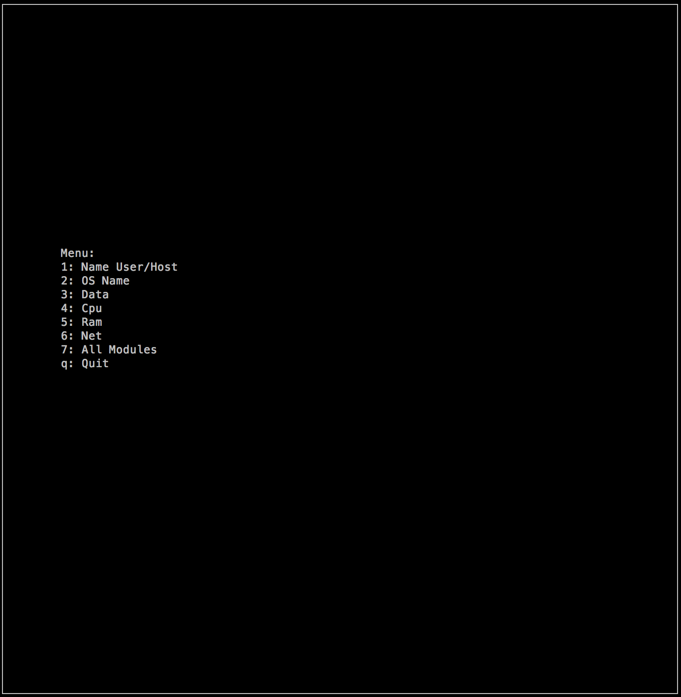
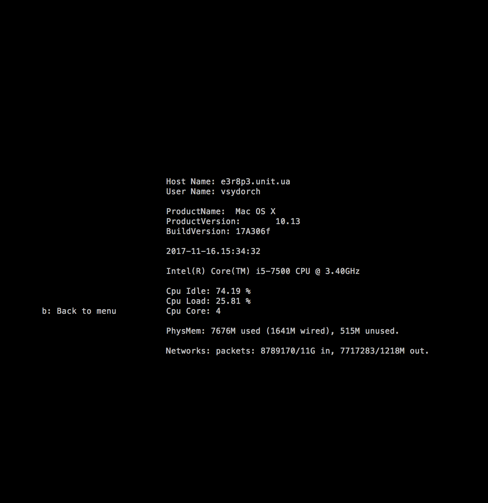
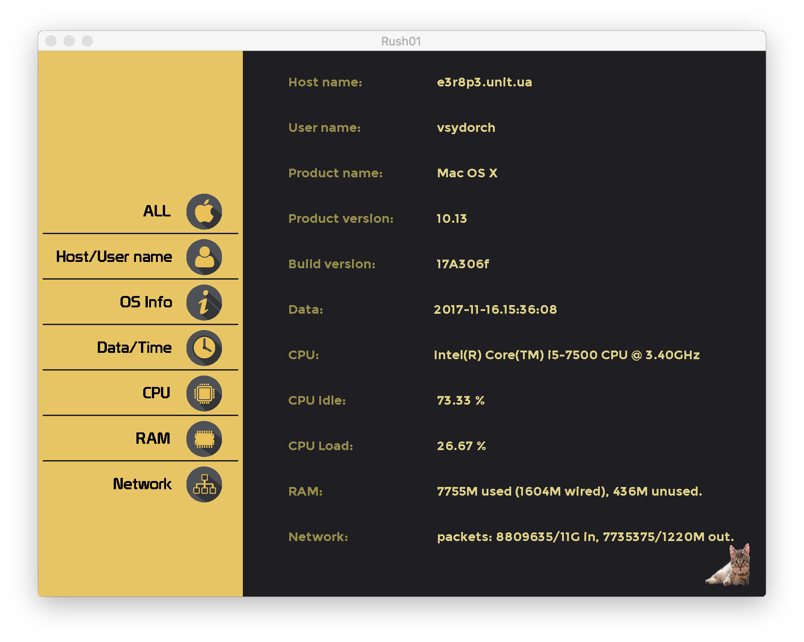
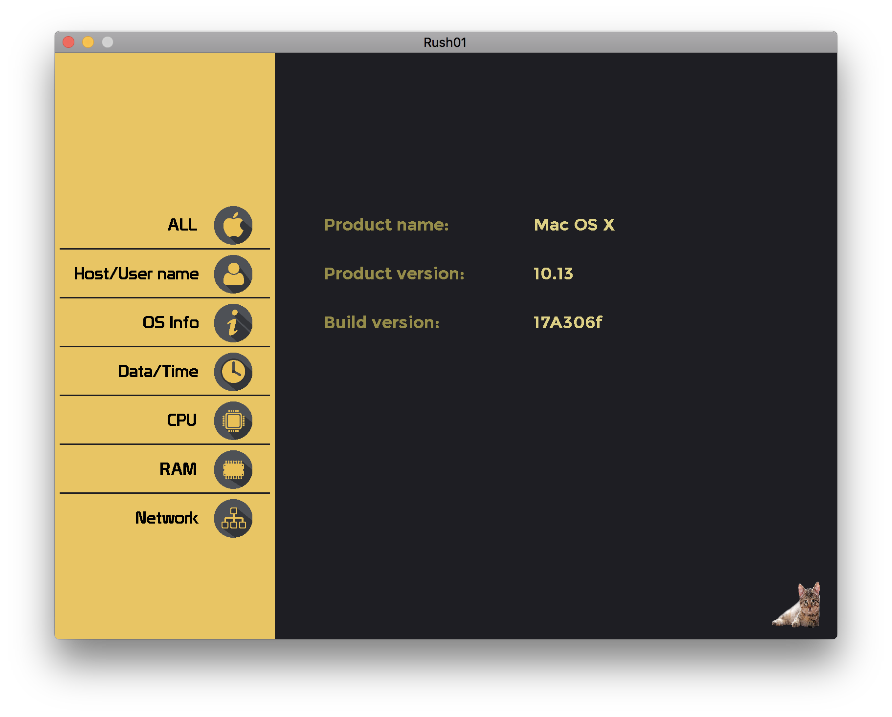
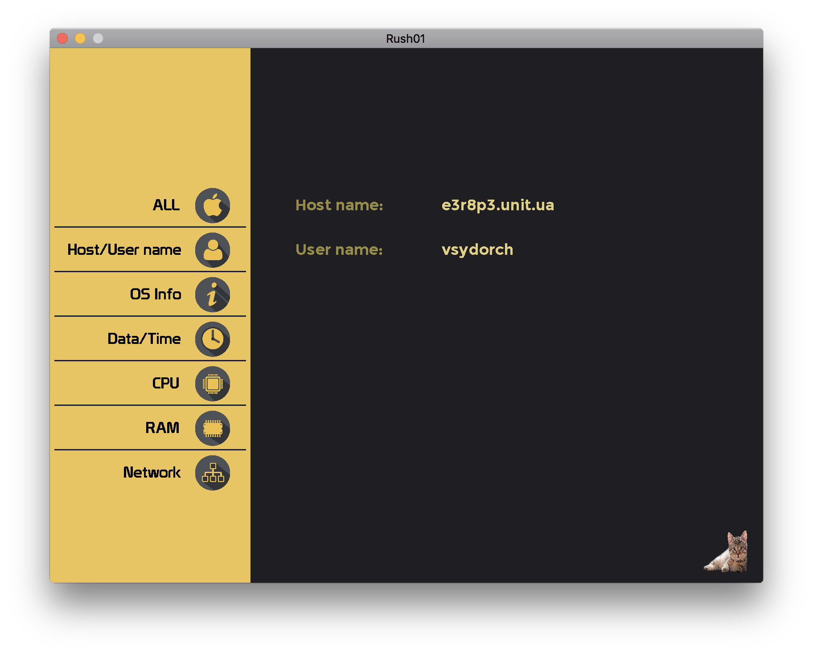

# **ft_gkrellm** #

In this project, we (my teammate - ilukaino and me) implemented simple program, which show different info about system.

### How it work? ###

* Run Makefile.
* ./ft_gkrellm N (or G)

* N - ncurses
* G - graphic

### We used ###

* C++
* Ncurses
* SDL library (graphic)

### Features ###

* Launch in two modes (terminal or graphic)
* Chose different modules

### Screenshots ###

* **Ncurses: Start**

* **Ncurses: All info**

* **SDL: Start & All info**

* **SDL: OS info**

* **SDL: Host/User name**

